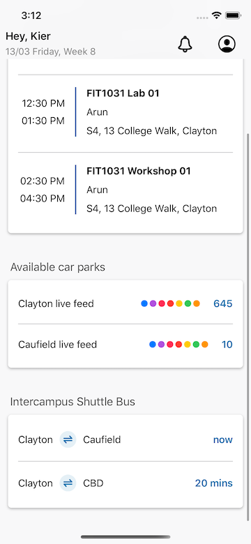

# Monash Code Challenge
---
Language: Swift 

The coding challenge for the Monash university app using the API `http://demo3299092.mockable.io/schedules` to query the list of courses in a week, parking available slots and the timetable of buses from and to Monash university campus. It was built by using **Xcode 11.3**

The project also runs unit testing to test the functions that have used in the project, which can be found in `CodingChallengeTests`


## Setup instructions
To install the appication 
* Open **CodingChallenge.xcodeproj** in the directory `/CodingChallenge`
* Run the application with Xcode to build the application.

## Solutions 

### JSON design
Given that the web service has a REST API which returns the schedule of a student in a week.Therefore, the JSON was designed to include student information, a list of courses within a week of a student, the car parks and their availability, and the bus that is coming from and to the university campus.

The JSON includes these objects `week`, `student`, `schedules`, `parkings`, `stops`.  

| Objects | Description |           
| ------ | ------ |
| week   | the current week  | 
| student | this is student information (student name, student id) |  
| schedules | list schedules of courses (course name, start time, end time, campus, lecturer/tutor)|   
| parkings  | list of parking places (parking name and number of slots)|   
| stops | list of stops (stop arrival, stop departure, predicted arrival time)|   
```
{
    "week" : 8,
    "student" : {
        "id": "305491",
        "name": "Kier"
    },
    "schedules": [
        {
            "start_time": "2020-03-13T10:00:00",
            "end_time": "2020-03-13T12:00:00",
            "course": "FIT1031",
            "class": "Lecture 01",
            "lecturer": "Arun",
            "room": "S4",
            "campus": "13 College Walk, Clayton"
        }
    ],
    "parkings": [
        {
            "name": "Clayton live feed",
            "slot": 645
        }
    ],
    "stops" : [
        {
            "departure" : "Clayton",
            "arrival": "Caufield",
            "predicted_arrival_date": "2020-03-13T06:04:05"
        }
    ]
}

```

### Following MVP design architecture

The default MVC architecture that Apple supports for iOS is good for a small project, but it is very hard to test because of the complicated ViewController. So, I use the MVP architecture to separate the coupling of the ViewController class into View class (ViewController) and Presenter class. The Presenter will handle the business logic, in this case, it loads the schedule data and then binding the data to the UI through `Delegation` pattern. Likewise, any errors that may happen while handling the business logic will be displayed as an alert view.

### UI Implementation
The given UI requires customization for the navigation controller as well as adding corner radius and shadow layer to table view section. 

#### Customize the Navigation Controller
I created a subclass of UIView named NavigationTitleView which includes two labels in a vertial stack view and add it to the titleView of the navigationItem. 

Setup Stack View: 
```sh
 private func setupView() {
        let stackView = UIStackView(arrangedSubviews: [titleLabel, subTitleLabel])
        stackView.axis = .vertical
        stackView.distribution = .fill
        stackView.alignment = .leading
        stackView.spacing = 5
        stackView.translatesAutoresizingMaskIntoConstraints = false
        addSubview(stackView)
    }
```

Adding to Title View of Navigation Item: 

```sh
let navigationView = NavigationTitleView()
navigationItem.titleView = navigationView
```

#### Add corner radius and shadow to table view section
To create the section having both corner radius and shadow layer without adding nested table view in the section, I have used a vertical stack view in a table view cell. The purpose of the stack view is to automatically resize container views. Next, I created three UIViews for three section types (Schedule, Parking and Bus Stop Timetable). Now, the whole view contains only 1 table view and 1 table view for each section (if it has data). Depending on the number of response items, the number of views will be created accordingly. Then they will be added sequentially into the stack view in the table view cell. The diagram below illustrates how the cell is handled.
```
Table View
└── table view cell 1
│    └── stack view
|        └── Course View 1
|        └── Course View 2
|        └── Course View 3
|
└── table view cell 2
│    └── stack view
|        └── Parking View 
└── table view cell 3
│    └── stack view
|        └── Bus Stop View 
```
In the table view cell `CourseCell`, I created three methods to configure those views. The example below indicates how the parking view is configured.
```
    /// Setup the parking view inside the cell
    /// - Parameter models: ParkingCellModel list
    func configureParkingView(_ models: [ParkingCellModel]) {
        
        if let cellModels = parkingViewModels, cellModels.count == models.count {
            return
        }
        parkingViewModels = models
        for (key, item) in models.enumerated() {
            let parkingView = ParkingView()
            parkingView.frame = CGRect(x: 0, y: 0, width: stackView.frame.width, height: 75)
            parkingView.configureCell(item)
            stackView.addArrangedSubview(parkingView)
            parkingView.seperatorView.isHidden = key == models.count - 1
        }
    }
```

UI after implementation

### Request and Deserialize JSON
The `APIRequest.swift` has been implemented to call the request deserialize the JSON response into `Timetable` instance. To decode the JSON, I have used Swift `Decodable` protocol. The model looks like this
```
// MARK: - Timetable
struct Timetable: Decodable {
    let week: Int
    let student: Student
    let schedules: [Schedule]
    let parkings: [Parking]
    let stops: [Stop]
}

// MARK: - Student
struct Student: Codable {
    let id, name: String
}

// MARK: - Schedule
struct Schedule: Decodable {
    let startTime, endTime, course, scheduleClass: String
    let lecturer, room, campus: String

    enum CodingKeys: String, CodingKey {
        case startTime = "start_time"
        case endTime = "end_time"
        case course
        case scheduleClass = "class"
        case lecturer, room, campus
    }
}

struct Parking: Decodable {
    let name: String
    let slot: Int
}


// MARK: - Stop
struct Stop: Decodable {
    let departure, arrival: String
    let predictedArrivalDate: String

    enum CodingKeys: String, CodingKey {
        case departure, arrival
        case predictedArrivalDate = "predicted_arrival_date"
    }
}

```
### Implement SystemService with Dendency Injection (DI)
The system service may contain the System Date, System Version. The purpose of this class is to improve the extendability and testability of the application. The users can now use the service in any places. Moreover, they can extend it to use for other purposes. 


### Unit testing
I have operated unit testing for the public functions of the application. For testing the failure case of URL request, I have created a MockFailSession which returns 500 status code. 
